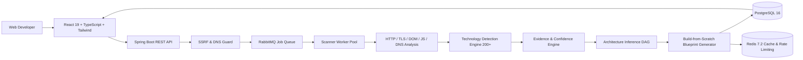

# 🔍 StackLens — Website Engineering Intelligence Platform

> **Transforming "What technologies does this website use?" into "How is this system probably structured, what evidence supports that conclusion, and how could I build a similar system myself?"**

---

## 🌟 Overview

**StackLens** is a developer-focused platform that performs safe, deep reverse-engineering of public websites to uncover their complete modern engineering stack. 

Beyond surface-level tech detection, StackLens executes an end-to-end intelligence pipeline:
1. **Safe Non-Intrusive Scan**: Extracts HTTP response headers, DOM tree, meta generators, JavaScript bundles/bytecode, cookies, TLS certificates, and DNS records.
2. **SSRF & DNS-Rebinding Guard**: Validates submitted URLs and blocks private/reserved IP spaces (`10.0.0.0/8`, `172.16.0.0/12`, `192.168.0.0/16`, `127.0.0.0/8`, `169.254.169.254`, IPv6 equivalents) with response size caps (5MB) and strict timeouts.
3. **Technology Detection Engine**: Evaluates 200+ signatures across 16 categories with weighted confidence scoring and concrete evidence trails.
4. **Observed vs. Inferred Separation**: Clearly distinguishes direct observable facts (e.g. Next.js, Cloudflare, Stripe) from architectural deductions (e.g. Private Spring Boot Microservices, PostgreSQL, Redis, RabbitMQ).
5. **Interactive System Architecture DAG**: Renders an interactive visual component flow diagram (*Client ➔ Edge CDN ➔ Frontend SSR/SPA ➔ API Gateway ➔ Backend Microservices ➔ PostgreSQL / Redis / RabbitMQ ➔ 3rd-Party SaaS*).
6. **Build-from-Scratch Engineering Blueprint**: Generates complete database schemas (PostgreSQL DDL), RESTful/GraphQL API contracts, authentication flows (OAuth2/JWT), multi-tier caching architectures, and a 4-phase implementation roadmap.
7. **Stack Comparison & History**: Side-by-side architecture diffing and persistent historical audits.

---

## 🏛️ System Architecture Pipeline



---

## 🚀 Quick Start (Local Development)

### 1. Run Frontend (React + TypeScript + Vite)
```bash
cd frontend
npm install
npm run dev
```
Open **[http://localhost:5173](http://localhost:5173)** in your browser.

### 2. Run Backend (Spring Boot 3)
```bash
cd backend
mvn spring-boot:run
```
API runs on **[http://localhost:8080](http://localhost:8080)** (automatically uses in-memory H2 database if PostgreSQL is not active).

---

## 🐳 Production Deployment with Docker Compose

Run the entire containerized stack with 1 command:
```bash
docker-compose up --build
```

### Services Started:
| Service | Port | Description |
| :--- | :--- | :--- |
| **Frontend** | `5173` | React 19 + TypeScript + Vite UI |
| **Backend API** | `8080` | Spring Boot 3 REST API & Intelligence Engine |
| **PostgreSQL** | `5432` | Primary Relational Database |
| **Redis** | `6379` | In-Memory Cache & Rate Limiter |
| **RabbitMQ** | `5672` / `15672` | Asynchronous Job Queue & Management UI |

---

## 📋 Features Breakdown

### 1. Interactive Architecture DAG Visualizer
- Visual node graph with real-time protocol annotations (`HTTPS`, `TCP`, `AMQP`, `INTERNAL RPC`).
- Filter components by **Observed** (Direct Evidence) vs **Inferred** (Architectural Logic).
- Click any node to view:
  - Component role in production
  - Confidence percentage (0–100%)
  - Concrete evidence trail (matching headers, script URLs, cookies)
  - Industry alternatives (e.g. for Spring Boot: Quarkus, NestJS, Go Fiber)

### 2. Build-from-Scratch Engineering Blueprint
- **Tech Stack Matrix**: Recommended modern stack for 100k+ DAU scale.
- **Database Schema**: Fully normalized PostgreSQL entities (`users`, `organizations`, `projects`, `audit_logs`) with copyable SQL DDL.
- **API Specifications**: Standardized REST and Webhook contracts with sample request and response payloads.
- **Auth Strategy**: RS256 JWT, HttpOnly cookies, session revocation, and MFA recommendations.
- **Multi-Tier Caching**: L1 Edge CDN + L2 Redis Application + L3 Database connection pooling.
- **4-Phase Implementation Plan**: MVP (W1-4), Worker Pipeline (W5-8), Intelligence (W9-12), Production Scale (W13-16).
- **Export**: One-click download as structured Markdown or JSON.

### 3. Security Perimeter & SSRF Guard
- Checks for `Strict-Transport-Security` (HSTS), `Content-Security-Policy` (CSP), `X-Frame-Options`, `X-Content-Type-Options`.
- Detects leaked server banners (`Server`, `X-Powered-By`).
- Autonomous DNS and ASN hosting resolution.
- Assigns a weighted **Security Grade (A+ to F)** with actionable remediation steps.

---

## 🔌 API Endpoints Reference

| Method | Path | Description |
| :--- | :--- | :--- |
| `POST` | `/api/scan` | Submits a target URL for safe asynchronous scanning |
| `GET` | `/api/scan/{id}` | Retrieves scan execution status and computed intelligence |
| `GET` | `/api/scan/history` | Returns the recent scans list |
| `GET` | `/api/health` | Service health and engine diagnostics |

---

## 🛡️ SSRF Security Safeguards

To prevent Server-Side Request Forgery (SSRF) and resource abuse:
1. **IP Range Blacklisting**: Pre-connection validation against RFC 1918 private subnets (`10.0.0.0/8`, `172.16.0.0/12`, `192.168.0.0/16`), loopback (`127.0.0.0/8`), and cloud metadata (`169.254.169.254`).
2. **DNS Rebinding Defense**: Pinning resolved IP before making the outbound HTTP request.
3. **Resource Capping**: 5MB max payload size limit and 10s strict network timeout.
